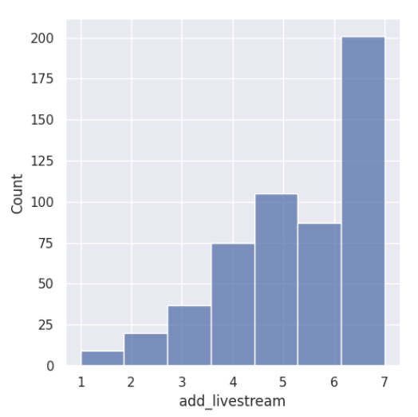
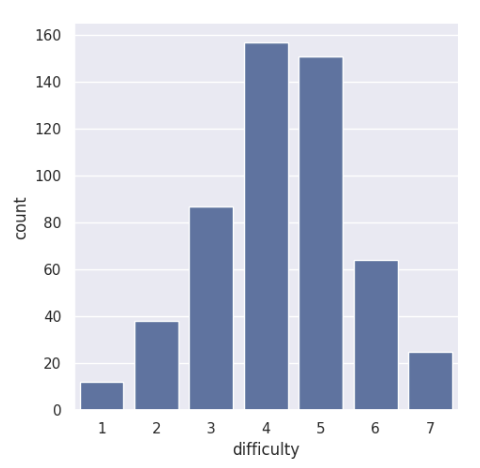
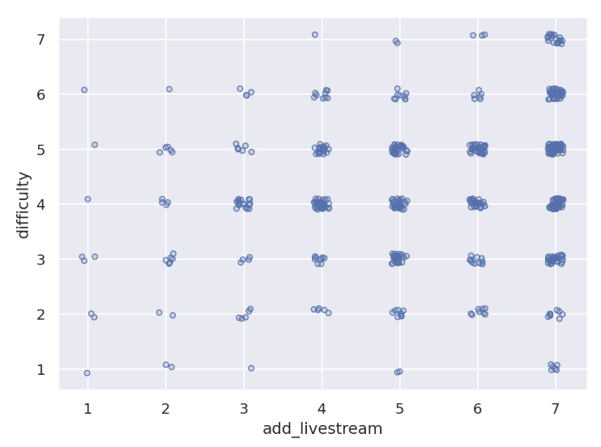
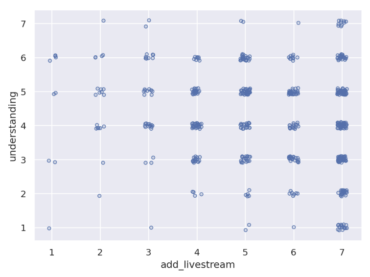

---
# Do not edit the text between these lines!
layout: default
---

# Summary
For EX09 I have completed an analysis of potentially improving COMP 110 by adding lecture videos to extend the course's flexibility and review repertoire. This analysis was completed utilizing the "add_livestream", "difficulty", and "understanding" variables from the survey responses. Students were grouped into two categories: those who wanted course livestreams and those who did not. Average difficulty and understanding ratings were then calculated to find if students who desired livestreams the most were struggling with the course. 

## Visualizations

To understand the spread of responses for the livestream survey question, a histogram was utilized, 0 = "Strongly Disagree," and 7 = "Strongly Agree." As seen below, a large proportion of the students enrolled would find these videos useful, as the bin with the highest frequency is the "Strongly Agree" response. The count function further revealed that 201 students strongly agreed (7) that adding livestreams would be useful.

Difficulty ratings were visualized utilizing a count plot, where 0 = I am finding COMP110 to be "Very Easy" and 7 = I am finding COMP110 to be "Very Difficult." The resulting graph displays a standard bell curve distribution, with the majority of students falling into the 4-5 difficulty rating. 

Livestream and difficulty scores were plotted on a jittered scatterplot to best visualize how many high difficulty students desired livestreams. Students with the highest desire for livestreams (add_livestream = 7) frequently rated course difficulty in the 3-7 range. Those who rated their desire for livestreams around the bulk of the distribution (add_livestream = 4-7) most prevalently rated course difficulty in the 3-5 range. 

Livestream and understanding scores were plotted on a jittered scatterplot to best visualize the course understanding of students who desired livestreams, where Understanding of: So far, I'm feeling like I typically 0 = "Am Lost" and 7 = "Understand Everything." students with a moderate to high desire for livestreams (add_livestream = 4-7) had a tendency to rate their understanding of the course in the 3-6 range. Those with the lowest course understanding (understanding= 1-2) had a strong desire for livestreams, with the majority rating their desire in the 6-7 range.

# Final Conclusions

## Analysis 

The first add livestream histogram demonstrates that a large proportion of the students enrolled would find these videos useful, as the bin with the largest frequency is the "Strongly Agree" response. The count function reveals that 201 students strongly agreed with adding livestreams. The difficulty rating countplot illustrates that most students rate the diffuculty of the course in the 3-4 out of 7 range, where the 3 and 4 bars landed in the 140-160 responses of students each. The histogram demonstrates that a large proportion of the students enrolled would find lecture videos helpful, and the countplot expands upon this finding, demonstrating that a considerable proportion of stakeholders find the course moderately to highly difficult. This establishes an opportunity for improvement as a stakeholder entity.

The scatterplots with jitter address the problem found with who exactly this improvement may help. If the majority of students that would find lecture videos helpful had low difficulty ratings and/or high understanding, this improvement would not be very effective; adding this improvement would then only help those who are already performing well in the course. 

The difficulty vs. livestream scatter illustrates how the students with the highest desire for livestreams (add_livestream = 7) most often rated course difficulty in the 3-7 range. Those who rated their desire for livestreams around the bulk of the distribution (add_livestream = 4-7) most prevalently rated course difficulty in the 3-5 range. 

The understanding vs. livestream scatter demonstrates that students with a moderate to high desire for livestreams (add_livestream = 4-7) had a tendency to rate their understanding of the course in the 3-6 range. Those with the lowest course understanding (understanding= 1-2) had a strong desire for livestreams, with the majority rating their desire in the 6-7 range. Average statistics of both understanding and difficulty were calculated for those who wanted livestreams (add_livestream: 5-7), finding an average difficulty (want livestream): 4.384, and an average understanding (want livestream): 4.122. This supports the claim that, on average, those who want livestreams find the course moderately difficult, whereas the understanding somewhat contradicts this claim, with considerable understanding of the course material despite wanting livestreams. 

## Key Takeaways

The statistics and visualizations found show considerable opportunity for improvement, as those who desire livestreams have a tendency to have higher ratings for difficulty, yet this is somewhat contradicted by their somewhat reasonable levels of understanding on average. This conveys that there is an opportunity to help those who are struggling the most in the course by providing lecture videos. This inclusion of videos would also allow for better course flexibility, as students could ensure not getting behind in material if they are ever unable to attend lecture in person. Adding past data from when lecture videos were provided may assist in better understanding the efficacy of this improvement. This would improve our understaning of if these videos are actually helpful to those with high difficulty ratings. In this data from past courses, including variables such as difficulty and understanding, as well as course engagement may capture the pros and cons of implementing this improvement. 

## Implications

The instructional staff stakeholders could potentially be negatively impacted, as course engagment may decrease as a result of adding lecture videos. This negative could be met with a positive tradeoff, however, since the videos could potentially improve student understanding, and therefore, average class performance may improve. This would be a positive reflection on instructors, yet course engagement may still fall as class performance does not always demonstrate true mastery of the material. If students enrolled engage less with the material and complete less active learning, it may lead to an overall lack of understanding in the material in comparison to requiring in-class attendance. If this were the case, the societal workforce may also suffer, as graduates who took COMP 110 may be hired under false pretenses, not actually having the data skills they need to perform at their job. 